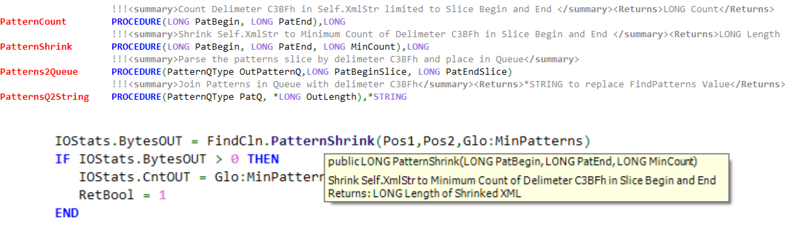

# Xml-Code-Comments-Clarion

Paste in a Procedure Prototype and Generate XML Code Comments in the Clarion format.


The !!! \<Xml> comments must be put in the INC file for the Intellisense to appear in
 the editor when you Include that .INC file in another CLW. 
 If you put the <Xml> comments in the .CLW file the Intellisense will only appear in that CLW.
 
### Compact Comments

Putting several !!! \<Xml> lines before each Procedure in the INC file can make
 the file long and hard to visually scan quickly.
 One option is to put a single !!! line before each Procedure with just
 the \<Summary> and \<Returns> so you leave out the \<param>'s.
 The Intellisense will show the parameters from the prototype so if you have descriptive labels
 the parameters should be understandable.

```Clarion
  !!!<summary>Join Patterns in Queue with delimeter C3BFh</summary><Returns>*STRING to replace FindPatterns Value</Returns>
PatternsQ2String    PROCEDURE(PatternQType PatQ, *LONG OutLength),*STRING
```

Below is a screen capture of an .INC file with single line !!! XML \<Summary> and \<Returns> comments
 and an Intellisense popup of code using that INC file.



Shown during the [ClarionLive Open Webinar August 18, 2021 at time 1:20:40](https://www.youtube.com/watch?v=0hTku3FA1Sg)
