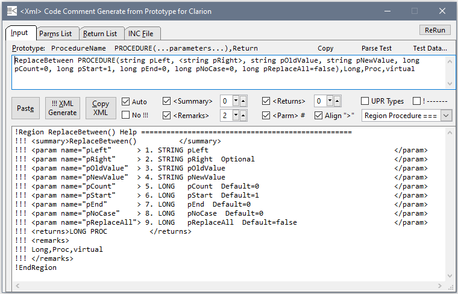

# Xml-Code-Comments-Clarion

Paste in a Procedure Prototype and Generate XML Code Comments in the Clarion format.



The !!! <Xml> comments must be put in the INC file for the Intellisense to appear in
 the editor when you Include that .INC file. 
 If you put the <Xml> in the .CLW file the intellisense will only appear in THAT CLW.
 
Putting several !!! <Xml> lines before each Procedure in the INC file can make
 the file long and hard to scan quickly. One option is to put single line with just
the <Summary> and <Returns> so you leave out the <param>'s.
 The Intellisense will show the parameters from the prototype.

```Clarion
  !!!<summary>Join Patterns in Queue with delimeter C3BFh</summary><Returns>*STRING to replace FindPatterns Value</Returns>
PatternsQ2String    PROCEDURE(PatternQType PatQ, *LONG OutLength),*STRING
```